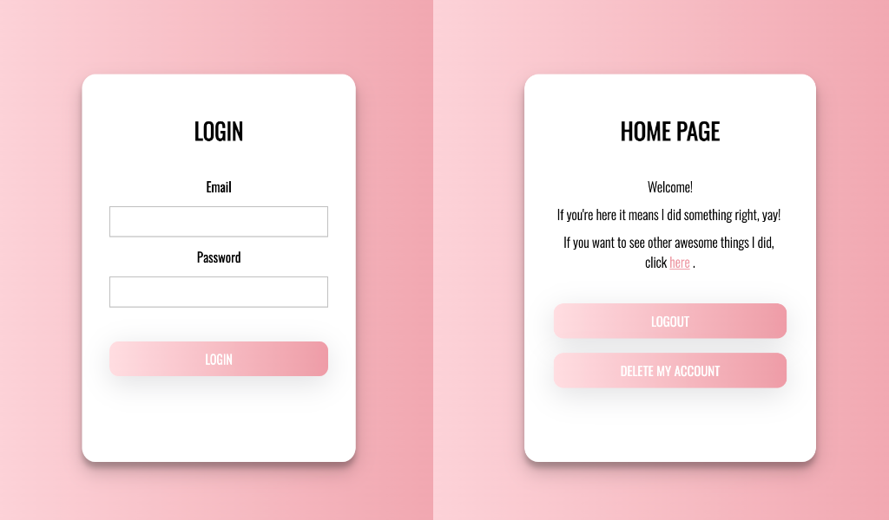

## Welcome! 👋

This is a solution to the [Zyax frontend programming assignment](https://github.com/zyaxab/frontend-programming-challenge).



### Assignment

The login form should have the following fields:

- Email address
- Password
- Sumbit button
- If the login is successful, the access token should be stored in a cookie or local storage.
- If the login fails, error message should be displayed.
- Logout button that removes the access token from the cookie or local storage

### Continued development

- Display appropriate message when the client sends an invalid request to the server
- Write test that checks if form stores the access token in a cookie or local storage if the login is successful
- Write test for logout button

### Built with

- [Create React App](https://github.com/facebook/create-react-app)
- Axios
- SASS
- Jest

### Getting Started

First install your dependencies:

```
npm install
```

To start the server, run the following command:

```
npm start
```

To launch the test runner in the interactive watch mode:

```
npm test
```

To build the app for production to the `build` folder:

```
npm test
```

**Have fun exploring!** 🚀
